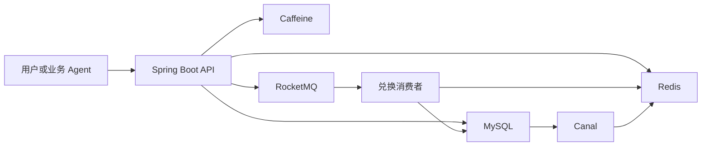

# 积分激励项目全景

> 这一页先讲业务为什么存在、系统里有哪些角色，以及旧秒杀链路处于什么位置。它不展开事务和缓存细节。

## 1. 业务目标

系统通过长期激励提高用户活跃和留存：用户完成任务获得积分，再用积分兑换奖品；秒杀活动允许用户用较少积分兑换高价值奖品。

当前代码包含两条业务主线：

- 任务积分：完成任务、领取奖励、增加用户积分。
- 奖品兑换：校验资格、受理兑换、异步扣库存和积分、查询结果。

## 2. 系统边界

## 3. 主要接口

| 接口 | 作用 | 是否写操作 |
| --- | --- | --- |
| `GET /userAward/exchange` | 受理积分兑换，返回处理中或失败 | 是 |
| `GET /userAward/result` | 查询兑换结果 | 否 |
| `GET /userAward/query` | 直接查询用户奖品记录，偏调试用途 | 否 |
| `GET /agent/query/users/{userId}/points` | Agent 查询用户积分 | 否 |
| `GET /agent/query/users/{userId}/tasks` | Agent 查询有效且尚可处理的任务 | 否 |
| `GET /agent/query/awards/{awardId}` | Agent 查询奖品详情 | 否 |
| `GET /agent/query/users/{userId}/awards` | Agent 查询奖品及用户兑换条件 | 否 |
| `GET /agent/query/users/{userId}/awards/{awardId}/eligibility` | Agent 检查兑换资格和积分缺口 | 否 |
| `GET /task/finish` | 标记用户完成任务 | 是 |
| `GET /task/reward` | 领取任务积分 | 是 |
| `GET /inventory/demo/tryAcquire` | Redis Lua 原子扣减演示 | 是，但不属于主业务链路 |

接口目前使用 GET 承载部分写操作，这是现状，不是推荐给 Agent 的工具设计方式。

## 4. 技术栈

- Java 17
- Spring Boot 3.2.3 父工程
- MyBatis 3、MySQL 8
- Redis、Lettuce 连接池、Redisson
- RocketMQ 事务消息和普通延迟消息
- Canal 1.1.7 订阅 MySQL binlog
- Caffeine 本地缓存
- Sentinel 限流
- Maven 构建

## 5. 关键状态

`user_award.status` 是兑换状态机：

| 状态 | 含义 |
| --- | --- |
| `0` | 已受理，等待异步消费 |
| `1` | 兑换成功 |
| `-1` | 兑换失败 |

HTTP 业务返回码中，`200` 表示成功，`502` 表示稍后查询，`505` 表示已兑换，`506` 表示积分不足，`507` 表示事务消息发送失败，`509` 是通用失败。

## 6. 当前明确不属于主链路的内容

- `/inventory/demo/tryAcquire` 只演示 Redis Lua 原子扣减。
- 注释掉的 `TestController` 不属于正式接口。
- 已删除的新链路不能作为设计参考。
- 压测代码、结果和历史性能结论不属于本上下文包。

## 7. Agent 第一版定位（历史起点）

> 本节只保留项目最初如何选择切入点，不代表当前能力范围。用户侧与运营侧的当前产品基线见根目录 `PRODUCT.md`，实施进度见 `../agent-design/20_Agent课程能力落地路线图.md`。

- 第一版是“积分规划与奖品兑换顾问”，核心是围绕目标奖品计算积分缺口并推荐任务。
- 普通订单列表和兑换结果轮询继续由页面完成，不作为核心 Agent 用例。
- 产品需求、工具契约和评测用例位于项目根目录 `docs/agent-design/`。
