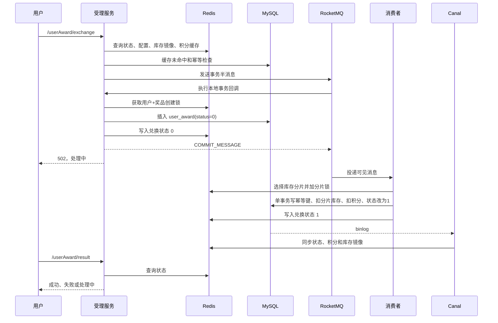

# 旧事务消息秒杀链路

> 这一页按照真实代码顺序，把一次兑换从入口校验、半消息、本地事务、异步消费一直讲到结果查询。后续 Agent 若要解释或修改兑换逻辑，应先以本页建立整体模型。

## 1. 主流程

## 2. 入口受理

`UserAwardServiceImpl.exchange` 先执行：

1. 校验 `userId` 和 `awardId`。
2. 查询兑换状态，阻止正在处理或已经成功的重复请求。
3. 查询奖品价格和结束时间。
4. 读取 Redis 总库存镜像；没有时回源 `award_config.inventory`。
5. 查询用户积分。
6. 查询数据库幂等键，本地只缓存“已经兑换”的正向结果。
7. 生成订单 ID，消息体只包含 `userId`、`awardId`、`id`、`messageTimeMillis`。
8. 调用 RocketMQ 事务消息，发送成功后向用户返回“处理中”。

入口库存和积分校验属于快速拒绝，不是最终一致性保障。最终是否成功由消费事务里的条件更新决定。

## 3. 半消息和本地事务

`TransactionProducerConfig` 中的事务监听器负责：

1. RocketMQ 先保存对消费者不可见的半消息。
2. 本地回调获取 `createOrder:award:{awardId}:user:{userId}` 锁。
3. 检查 Redis 中该用户和奖品的状态。
4. 插入 `user_award(status=0)` 作为预分配记录。
5. 写入 Redis 状态 `0`。
6. 插入成功返回 `COMMIT_MESSAGE`，否则返回 `ROLLBACK_MESSAGE`。

RocketMQ 回查时，代码按 `userId + awardId + status=0` 查询预分配记录：存在则提交半消息，不存在则回滚。

这里的“本地事务”首先是 RocketMQ 的事务回调概念。`executeLocalTransaction` 本身没有 Spring `@Transactional`，当前数据库业务操作只有一条 `user_award` INSERT，Redis 状态写入也不与 MySQL 构成同一个原子事务。

## 4. 消费和库存分片

普通奖品走 `TransactionConsumer.tryConsumeOldChainRound`：

1. 从 Redis Hash `award_inventory_split:{awardId}` 获取当前有效分片。
2. 将 `splitId` 排序，使用订单 ID、重试次数和轮次计算首选分片。
3. 从首选分片开始线性探测全部分片。
4. 对每个候选分片获取 `inventoryLock:award:{awardId}:split:{hashKey}` 锁。
5. Redis 分片库存小于等于 0 时删除该 Hash 字段，继续探测。
6. 调用 `ConsumerServiceImpl.update1` 完成一个 MySQL 事务：
   - 插入 `idempotent_table` 唯一键；
   - `inventory > 0` 时扣减指定库存分片；
   - `currency >= price` 时扣减积分；
   - 将 `user_award.status` 更新为 `1`。
7. 事务成功后将 Redis 状态写为 `1`。

任一步失败都会使数据库事务回滚。数据库唯一键、条件扣库存和条件扣积分共同承担最终正确性。

`isOverSell != 0` 时走 `update2`，不扣库存分片；这条分支在当前源码中存在已知问题，见 `06_已知约束与待确认问题.md`。

## 5. 重试和失败

重试分三层：

1. 线程内短重试：默认 2 轮，轮次之间按配置短暂退避。
2. 自定义延迟消息：默认最多 6 次，消息记录 `oldChainRetryCount` 和失败原因。
3. RocketMQ 原生重试：延迟消息发送失败或自定义次数耗尽后返回 `RECONSUME_LATER`，默认最多 3 次。

最终进入死信队列后，`DeadLetterConsumer` 将预分配记录改为 `-1`，并记录一次失败完成指标。

## 6. 结果查询

`/userAward/result` 的读取顺序是：

1. 新 Redis 状态键 `user_award:status:{userId}:{awardId}`。
2. 兼容旧 Hash 键 `user_award:{userId}-{awardId}` 的 `status` 字段。
3. MySQL `user_award`。

状态 `0` 返回处理中，`1` 返回兑换成功，其他状态返回失败。
