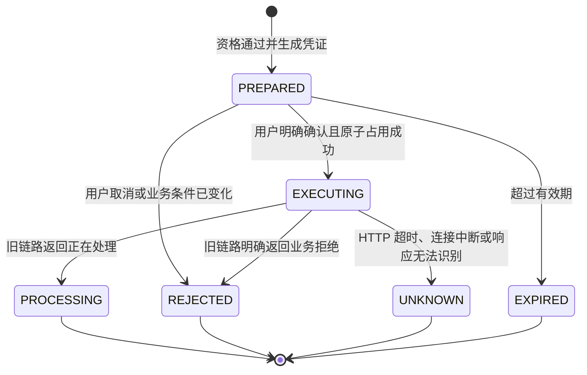

# 受控兑换 Skill：需求与状态机

> 当前 Agent 已经能判断用户是否满足兑换条件，但真正兑换会扣积分、扣库存并创建订单。这里要解决的不是“让模型多调用一个接口”，而是如何确保只有当前用户在看清奖品和积分消耗后明确确认，系统才执行一次旧事务消息链路。

## 1. 产品目标

在现有积分规划与奖品推荐能力之上，增加一条受控写入流程：

```text
用户表达兑换意图
  -> 查询实时兑换资格
  -> 生成一次性确认凭证并展示兑换摘要
  -> 用户明确确认
  -> 服务端校验并原子消费确认凭证
  -> 调用旧链路受理兑换
  -> 返回“处理中”“明确拒绝”或“提交结果未知”
```

本阶段仍然遵守以下边界：

- 只调用旧事务消息链路，不引入 Redis 预扣等新链路。
- Agent 不代替页面轮询最终结果，也不把“已受理”说成“兑换成功”。
- 不允许模型提供或修改 `user_id`，用户身份继续由运行时绑定。
- 不直接向模型暴露 MySQL、Redis、RocketMQ 或任意内部命令。
- 先完成设计与评测基线，评审通过后再实现写接口。

## 2. 为什么不能只在 Prompt 中要求二次确认

仅让 System Prompt 记住“调用兑换前先确认”存在三个问题：

1. 模型可能把“我考虑一下”“还是 6 号吧”误判为确认。
2. 对话记忆被淘汰、截断或跨会话时，无法可靠证明用户确认的是哪个奖品。
3. 同一句确认在超时、重试或并发请求中可能触发多次工具调用。

因此，确认必须成为服务端可校验的状态，而不是只存在于模型对话历史中。对话记忆可以帮助理解语言，但不能作为执行高风险写操作的授权凭据。

## 3. 一次性确认凭证

用户表达兑换意图后，`prepare_exchange` 先查询实时资格，并创建短期确认记录：

| 字段 | 作用 |
| --- | --- |
| `confirmation_id` | 不可预测的一次性凭证，由服务端生成 |
| `user_id` | 与当前登录用户绑定，不接受模型输入 |
| `session_id` | 与发起准备动作的会话绑定 |
| `award_id` | 用户准备兑换的奖品 |
| `request_id` | 关联准备阶段的日志和轨迹 |
| `status` | `PREPARED`、`EXECUTING`、`PROCESSING`、`REJECTED`、`UNKNOWN`、`EXPIRED` |
| `expires_at` | 凭证失效时间，第一版建议可配置为 120 秒 |

第一版本地实现可以使用带 TTL 和容量上限的进程内存储。服务重启后凭证全部失效，这会牺牲便利性，但不会扩大写权限。多实例部署时必须迁移到 Redis 或数据库，并用原子条件更新保证同一凭证只被消费一次。

## 4. 状态流转



关键规则：

- `PREPARED -> EXECUTING` 必须是原子操作，并且只能成功一次。
- 用户改换奖品时，旧凭证立即失效，重新生成新凭证。
- `confirm_exchange` 不再接收 `award_id`，只能使用凭证中已经冻结的奖品。
- 真正调用旧链路时仍会重新校验库存、积分、活动时间和兑换状态；准备阶段的资格通过不代表确认时仍然满足条件。
- `UNKNOWN` 表示无法判断写请求是否到达 Java 服务，不能自动重试，也不能直接宣称失败。

## 5. 各层职责

| 层级 | 负责 | 不负责 |
| --- | --- | --- |
| 模型 | 识别兑换意图、解释摘要、识别明确确认 | 保存授权事实、生成有效凭证、判断写入是否真正成功 |
| Skill | 编排资格检查、确认记录和写 Tool，维护业务状态机 | 绕过后端校验、直接操作中间件 |
| Tool | 校验 Schema、执行单次 Java 调用、保留原始错误语义 | 对未知结果自动重试、跨步骤猜测用户意图 |
| Java 适配接口 | 注入身份、调用旧 `exchange` 服务、映射稳定业务码 | 把受理成功包装成最终兑换成功 |
| 旧事务消息链路 | 最终校验、半消息、本地事务和异步消费落账 | 理解自然语言和管理 Agent 会话 |

## 6. 用户可见语义

Agent 必须区分三种结果：

- **等待确认**：说明奖品、所需积分和本次操作，要求用户明确确认。
- **处理中**：只说明旧链路返回正在处理；当前接口无法区分本次刚受理和此前已经处理中，最终结果到订单页面查看。
- **提交结果未知**：说明当前无法判断是否已受理，禁止立即再次兑换，建议先到订单页面核对。

“确认兑换”“确定”“就换这个”只有在同一会话存在未过期且唯一的待确认动作时，才可以触发写 Tool。没有待确认动作时，即使用户直接说“确认”，也只能重新准备，不能执行兑换。

## 7. 验收标准

- 没有有效确认凭证时，旧兑换接口调用次数必须为 `0`。
- 同一凭证无论顺序重复还是并发确认，旧兑换接口最多调用 `1` 次。
- 用户、会话、奖品任一不匹配时拒绝执行。
- 兑换条件在确认前变化时，以旧链路的实时校验结果为准。
- HTTP 超时或响应异常时返回 `SUBMISSION_UNKNOWN`，不自动重试。
- 所有准备、确认、拒绝和未知结果都能通过 `request_id` 与 Tool 轨迹审计。
- 已有积分查询、积分规划和奖品推荐用例不得回归失败。

## 8. 对应课程方法

- 第三节 Function Calling：写 Tool 使用严格参数 Schema 和稳定结果码，不能依赖自然语言字符串分支。
- 第十节 Skill：授权要有范围、时效、撤销和审计；高风险误触发首先止损；Tool 只处理物理层错误，非幂等写入的未知状态不得盲目重试。
- 第七节记忆：会话历史用于理解上下文，但确认凭证独立存储，不能把 Memory 当作执行授权。
