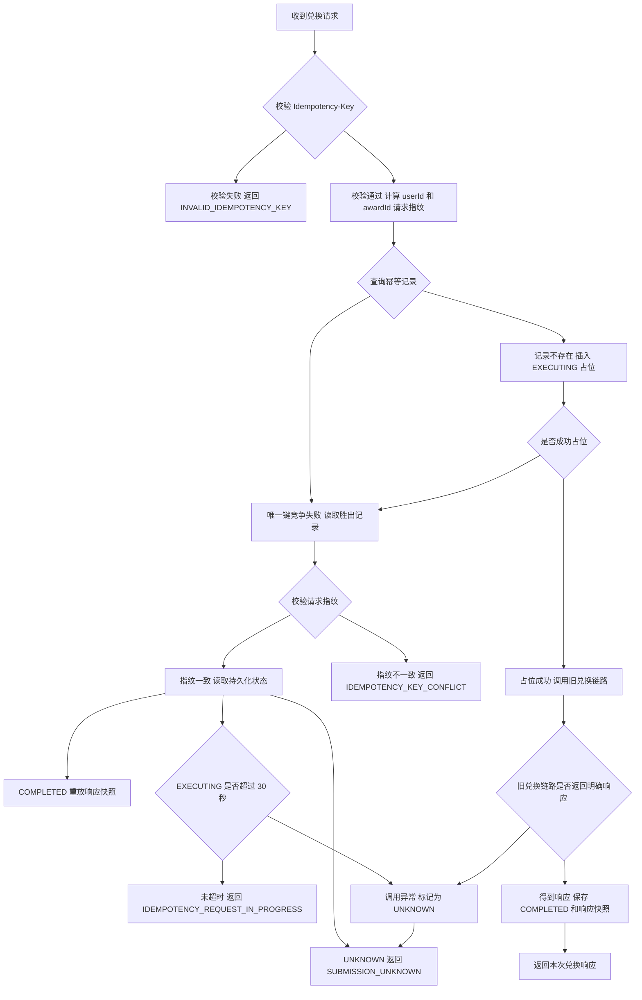

# Java 兑换请求持久化幂等

> 这一阶段解决的是“同一次 Agent 确认因为并发、超时或多实例而再次到达 Java 时，会不会重复调用旧兑换链路”。它不改变旧事务消息的业务流程，而是在入口前增加一层可恢复、可审计的请求状态机。

## 1. 为什么需要两层幂等

项目现在有两种语义不同的幂等，不能共用一张表：

| 层级 | 数据表 | 防止的问题 | 写入时机 |
| --- | --- | --- | --- |
| HTTP 请求级 | `agent_exchange_request` | 同一个 `Idempotency-Key` 重复调用旧兑换入口 | 发送事务消息之前先占位 |
| 业务消费级 | `idempotent_table` | RocketMQ 消息重复投递导致重复扣库存和积分 | 消费事务内写入 |

如果只使用消费幂等表，那么第二个 HTTP 请求仍可能再次发送事务消息，只是最终消费时才被拒绝。请求级幂等把重复操作挡在消息发送之前，同时能够保存明确拒绝和提交结果未知等状态。

## 2. 状态机



图中的 `UNKNOWN` 表示旧兑换链路可能已经产生副作用，但入口没有得到可以安全重放的明确结果。此时只能查询订单或进行对账，不能再次调用兑换入口。

```text
首次请求
  -> INSERT EXECUTING（idempotency_key 唯一）
  -> 调用旧兑换链路
     -> 得到明确响应 -> COMPLETED + 响应快照
     -> 调用抛出异常 -> UNKNOWN

重复请求
  -> 同键同参数 + COMPLETED -> 重放响应快照，不调用旧链路
  -> 同键同参数 + EXECUTING -> 返回执行中，不抢占执行
  -> EXECUTING 超过 30 秒 -> UNKNOWN，不自动重放
  -> 同键同参数 + UNKNOWN -> 返回结果未知
  -> 同键不同参数 -> IDEMPOTENCY_KEY_CONFLICT
```

请求指纹是 `userId + awardId` 规范字符串的 SHA-256。这样同一个幂等键不能被改换用户或奖品后重复利用。

幂等键只允许 ASCII 字母、数字和 `._:-`，数据库使用 `ascii_bin` 精确比较，避免默认大小写不敏感排序规则混淆两个不同键。

## 3. 并发与故障边界

1. 正常路径先查询历史记录，减少重复请求触发唯一键异常。
2. 多实例同时收到首次请求时，以数据库唯一键决定唯一执行者。
3. 唯一键竞争失败者重新读取胜出记录，不调用 `UserAwardService.exchange()`。
4. 旧链路调用异常时，消息可能已经到达 MQ，因此状态只能是 `UNKNOWN`，不能删除记录并自动重试。
5. 进程在占位后直接崩溃时，记录会停在 `EXECUTING`；30 秒后读取方将其转为 `UNKNOWN`，仍然不自动重放。
6. 只有明确得到并持久化响应后，重复调用才会重放 `COMPLETED` 的响应快照。

这套设计优先保证“不因重试产生重复副作用”。`UNKNOWN` 的后续恢复应查询订单结果，而不是再次调用兑换入口。

## 4. 代码位置

| 位置 | 作用 |
| --- | --- |
| `service/AgentExchangeCommandService.java` | 占位、指纹校验、状态迁移、响应重放和旧链路适配 |
| `dao/mapper/AgentExchangeRequestMapper.java` | 使用条件 UPDATE 持久化完成或未知状态 |
| `dao/model/AgentExchangeRequest.java` | 请求状态和响应快照模型 |
| `controller/AgentCommandController.java` | 校验 Header、记录请求日志并调用幂等服务 |
| `sql/migrate_agent_exchange_idempotency.sql` | 为已有数据库新增请求表 |
| `AgentExchangeCommandServiceTest.java` | 验证首次执行、重放、冲突、并发竞争、异常和过期执行 |

## 5. 验证结果

- Java 定向测试：幂等服务 `6/6`，Controller `4/4`。
- Java 编译：`mvn -q -DskipTests compile` 通过。
- Agent Python 回归：`47/47` 通过。
- 本地 MySQL 迁移执行成功，唯一键和请求状态字段与设计一致。
- 真实 HTTP 冒烟：同键同参数两次响应完全一致；同键异参返回 `IDEMPOTENCY_KEY_CONFLICT`；数据库只有一条 `COMPLETED` 请求记录。
- 冒烟使用不存在的用户，没有发送事务消息；验证记录已从数据库清理。

## 6. 尚未解决的问题

- 演示环境的用户身份仍由请求参数传入，生产环境需要登录态或网关注入可信身份。
- `UNKNOWN` 目前只要求用户到订单页面核对，尚未实现按订单自动对账和状态收敛。
