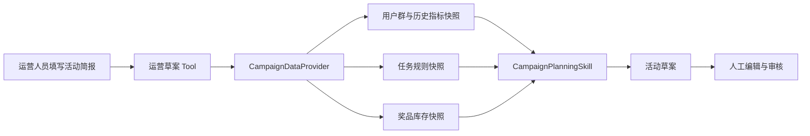

# 运营活动草案最小闭环

> 本阶段先解决一个基础问题：运营人员给出活动目标以后，系统能否基于真实只读数据生成一份可检查的草案，而不是让大模型凭经验编造用户规模、库存和成本。发布活动仍由后续的人工审核与确定性服务负责。

## 1. 本轮交付了什么

本轮完成 `P4.1` 的第一个可运行切片：

1. 定义活动简报、用户群、任务、奖品、历史指标和活动草案模型。
2. 定义 `CampaignDataProvider`，把业务事实读取与草案算法隔离。
3. 新增 `campaign-planning` Skill，根据事实快照确定性生成草案。
4. 新增独立的运营 Tool 构建器，不把运营能力混入普通用户的兑换顾问。
5. 草案固定为可编辑、不可发布、必须人工审核，并保留来源快照和风险。

本轮没有接入生产运营接口，也没有实现活动发布。这不是遗漏，而是为了先把身份边界和数据契约稳定下来。

## 2. 数据如何流动



这里最重要的边界是：模型可以填写活动目标和约束，但不能填写库存、用户群规模和历史参与率。这些动态事实只能来自 `CampaignDataProvider`。

## 3. 核心数据模型

### 3.1 CampaignBrief：运营人员明确给出的约束

```json
{
  "objective": "召回长期未活跃用户",
  "target_segment": "近30天未登录且历史积分大于500",
  "budget_amount_cents": 1600000,
  "points_issuance_cap": 50000,
  "start_at": "2026-08-23T12:00:00+08:00",
  "end_at": "2026-08-29T12:00:00+08:00",
  "max_tasks": 2,
  "max_awards": 2
}
```

`budget_amount_cents=1600000` 表示奖品金额预算为 `16000.00` 元。内部使用整数“分”，避免浮点金额误差。`points_issuance_cap=50000` 是任务最多发放的积分，两者是独立约束。

`CampaignBrief` 不包含库存、奖品成本、参与率和用户规模，因为这些不是运营人员在对话中可以随意决定的事实。

### 3.2 CampaignPlanningSnapshot：只读事实快照

```json
{
  "snapshot_id": "snapshot-20260822-001",
  "generated_at": "2026-08-22T11:00:00+08:00",
  "segment": {
    "segment_key": "inactive-30d-points-500",
    "description": "近30天未登录且历史积分大于500",
    "estimated_users": 1000,
    "as_of": "2026-08-22T11:00:00+08:00"
  },
  "tasks": [
    {
      "task_id": 1,
      "task_name": "连续签到",
      "reward_points": 100,
      "max_completions_per_user": 1,
      "source_ref": "task_rule:1:v2"
    }
  ],
  "awards": [
    {
      "award_id": 6,
      "award_name": "智能手环",
      "required_points": 1000,
      "unit_cost_cents": 10000,
      "inventory": 150,
      "cost_source_ref": "award_config:6:unitCostCents",
      "source_ref": "award_config:6"
    }
  ],
  "historical_metrics": [
    {
      "metric_name": "participation_rate",
      "value": 0.2,
      "sample_size": 3000,
      "as_of": "2026-08-15T12:00:00+08:00",
      "source_ref": "campaign_metrics:recall_30d:v3"
    }
  ]
}
```

这里的 `required_points=1000` 表示用户兑换门槛，`unit_cost_cents=10000` 表示运营侧单位成本为 `100.00` 元。两者来自不同业务口径，不存在固定换算关系。`snapshot_id` 解决“这份草案依据的是哪批数据”的追溯问题，`source_ref` 解决“某个任务、奖品或指标来自哪里”的追溯问题。

### 3.3 CampaignPlanDraft：只能审核，不能发布

```json
{
  "status": "DRAFT_READY",
  "lifecycle_status": "DRAFT",
  "editable": true,
  "publishable": false,
  "review_required": true,
  "estimated_participants": 200,
  "estimated_points_issued": 36000,
  "planned_award_cost_cents": 1600000,
  "suggested_tasks": ["连续签到", "浏览指定商品"],
  "suggested_awards": [
    {"award_id": 6, "planned_quantity": 150, "planned_cost_cents": 1500000},
    {"award_id": 8, "planned_quantity": 5, "planned_cost_cents": 100000}
  ],
  "risks": ["候选奖品库存覆盖不足"],
  "source_snapshot_id": "snapshot-20260822-001"
}
```

即使草案状态为 `DRAFT_READY`，也只说明机器检查没有发现阻断问题，不代表活动可以自动发布。

## 4. 积分、奖品与金额如何对应

三类数值分别回答不同问题：

| 字段 | 含义 | 约束对象 |
| --- | --- | --- |
| `required_points` | 用户兑换一个奖品需要多少积分 | 用户兑换资格 |
| `unit_cost_cents` | 企业提供一个奖品的真实单位成本 | 运营金额预算 |
| `reward_points` | 用户完成一个任务可得多少积分 | 活动积分发放上限 |

不能写成“1000 积分等于 100 元”。积分是平台激励单位，金额是采购或核算成本；同样价值的奖品可以因运营策略设置不同积分门槛。

### 4.1 任务侧：计算积分发放量

首先使用同类历史活动参与率估算参与人数：

```text
预计参与人数 = 向上取整(目标用户数 × 历史参与率)
```

然后计算人均积分发放上限，并在上限内选择任务：

```text
人均积分发放上限 = 总积分发放上限 ÷ 预计参与人数
预计发放积分 = 预计参与人数 × 每人完成全部建议任务所得积分
```

例如目标用户 `1000` 人、历史参与率 `20%`、积分发放上限 `50000`：

```text
预计参与人数 = 1000 × 20% = 200
人均积分发放上限 = 50000 ÷ 200 = 250
选择 100 分和 80 分的两个任务
预计发放积分 = 200 × 180 = 36000
```

这里按预计参与者完成全部建议任务计算，是偏保守的积分发放量。

### 4.2 奖品侧：计算真实金额

当前草案按单位成本从低到高规划奖品数量，在预算内尽量覆盖预计参与者，每人最多规划一个奖品名额。这个“一人一个名额”是草案计算假设，会作为 `AWARD_QUANTITY_ASSUMPTION_REVIEW_REQUIRED` 明示给运营审核，而不是冒充既定业务规则：

```text
单项计划成本 = 计划数量 × 奖品单位成本
计划奖品总成本 = 各单项计划成本之和
```

例如金额预算为 `1600000` 分：

```text
智能手环：150 × 10000 分 = 1500000 分
蓝牙耳机：5 × 20000 分 = 100000 分
计划奖品总成本 = 1600000 分 = 16000.00 元
```

这只是确定性初稿，奖品与活动目标是否匹配仍需运营审核。缺少历史参与率时系统不会猜人数；缺少 `unit_cost_cents` 时系统返回 `AWARD_UNIT_COST_MISSING`，不会用兑换积分反推金额。

## 5. 为什么与用户侧 Agent 分开

当前 JWT 只表达普通用户身份，没有运营角色和运营权限。如果把活动规划 Tool 直接注册进兑换顾问，会出现两个问题：

1. 普通用户可能读取用户群、库存汇总和历史活动指标。
2. 同一个 Agent 同时承担用户服务和运营策划，Prompt、Tool 和权限边界都会变得模糊。

因此本轮新增 `build_operator_tools`，要求调用方具备活动读取和草案权限，但暂时不挂到现有 `/v1/chat`。下一阶段需要先建立可信运营入口，再接真实数据适配器。

这不是多 Agent。当前只是两个调用边界；是否拆成策划、分析和审核多个 Agent，要等运营任务足够复杂并出现稳定职责冲突后再验证。

## 6. 已验证的关键边界

定向测试共 `9/9` 通过，其中活动规划相关场景包括：

| 场景 | 预期结果 |
| --- | --- |
| 快照完整且预算可行 | 生成可追溯、不可发布的草案 |
| 缺少历史参与率 | 返回 `NEEDS_DATA`，不猜测 |
| 快照超过 24 小时 | 返回 `NEEDS_DATA`，要求刷新 |
| 任务奖励无法放入预算 | 返回 `CONSTRAINT_CONFLICT` |
| 运营身份只有读取权限 | 只构建快照 Tool，不提供草案 Tool |
| 运营身份缺少读取权限 | 拒绝构建运营 Tool |

本轮调整后的定向验证为 Python `17/17`、Java `8/8`，没有执行项目全量回归。

## 7. 下一阶段

`P4.1` 的真实只读快照、运营入口、确定性草案和评测基线已经完成。下一阶段进入 `P4.2`，扩充历史活动复盘、运营制度和异常处理知识；活动发布仍不进入当前阶段。
