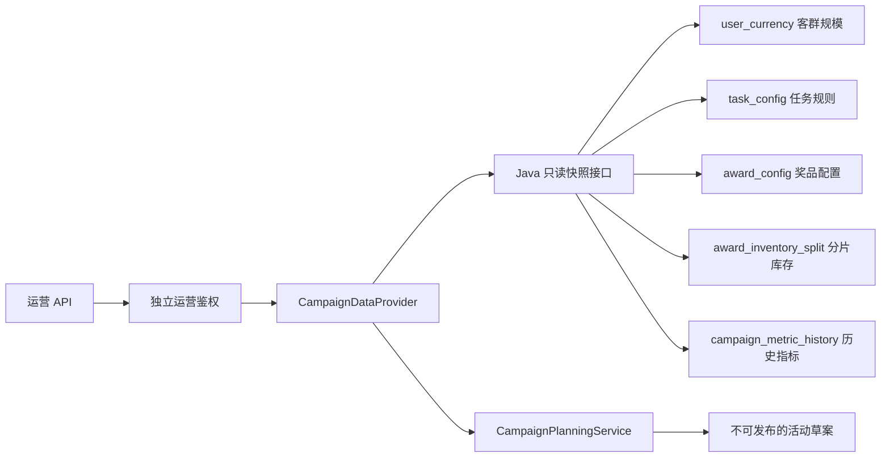

# 运营身份与真实只读快照

> 本阶段把上一阶段的静态活动草案接到真实业务数据上，并为运营能力建立独立入口。普通用户仍然只能使用兑换顾问；运营人员只能在服务端配置的权限范围内读取快照或生成草案，任何草案仍不能直接发布。

## 1. 为什么不能复用用户接口

普通用户身份只表达“我是谁”，运营身份还需要表达“我被允许做什么”。如果共用一套令牌和 Tool，用户侧 Prompt、运营数据权限和审计记录会混在一起。因此本轮使用独立运营令牌，并由服务端绑定运营 ID 与权限：

```text
OPERATOR_ID=local-operator
OPERATOR_PERMISSIONS=campaign:read,campaign:draft
```

客户端只能提交不透明令牌，不能在请求中增加自己的权限。普通用户令牌访问 `/v1/operator/*` 会被拒绝。

## 2. 客群不是两张新表

当前只支持两个能由数据库直接计算的固定客群：

| 客群键 | 数据库计算规则 |
| --- | --- |
| `ALL_USERS` | `user_currency` 中的全部用户 |
| `POINTS_AT_LEAST_500` | `user_currency.currency >= 500` 的用户 |

调用方提交客群键，Java 服务负责把它映射成固定 SQL 和可读说明。类似“近 30 天未登录”的描述因为当前没有最后活跃时间，服务端会返回 `UNSUPPORTED_CAMPAIGN_SEGMENT`，而不是估算人数。

## 3. 快照从哪里来



普通奖品库存使用分片库存之和，不能读取可能滞后的 `award_config.inventory`；允许超卖的奖品继续读取配置库存。奖品单位成本读取 `award_config.unitCostCents`，兑换积分仍读取 `price`，二者不做换算。每个字段都带有 `sourceRef`，便于追查事实来源。

### 3.1 快照示例

```json
{
  "snapshotId": "9dca...",
  "generatedAt": "2026-08-22T21:00:00+08:00",
  "segment": {
    "segmentKey": "POINTS_AT_LEAST_500",
    "description": "当前积分不少于 500 的用户",
    "estimatedUsers": 16,
    "asOf": "2026-08-22T21:00:00+08:00"
  },
  "tasks": [{
    "taskId": 1,
    "taskName": "每日签到",
    "rewardPoints": 20,
    "maxCompletionsPerUser": 1,
    "active": true,
    "sourceRef": "task_config:1"
  }],
  "awards": [{
    "awardId": 6,
    "awardName": "智能手表",
    "requiredPoints": 5000,
    "unitCostCents": 49900,
    "inventory": 19,
    "active": true,
    "costSourceRef": "award_config:6:unitCostCents",
    "sourceRef": "award_inventory_split:6:sum"
  }]
}
```

## 4. 为什么新增历史指标表

现有业务表没有“某次活动面向哪个客群、实际参与多少人”的事实，无法可靠计算历史参与率。因此新增统一的 `campaign_metric_history`，而不是为两个客群各建一张表：

```text
segment_key = POINTS_AT_LEAST_500
metric_name = participation_rate
metric_value = 0.26
sample_size = 16
measured_at = 2026-08-15 20:00:00
source_ref = demo_campaign_report:points_at_least_500:202608
```

正式迁移只创建空表，不写入虚构指标。演示初始化脚本包含明确标记为 `demo_campaign_report` 的样例；真实环境没有历史记录时，草案会返回 `PARTICIPATION_RATE_MISSING`。

## 5. API 与权限

| API | 所需权限 | 作用 |
| --- | --- | --- |
| `GET /v1/operator/campaign/snapshots/{segmentKey}` | `campaign:read` | 查看真实规划快照 |
| `POST /v1/operator/campaign/drafts` | `campaign:read`、`campaign:draft` | 基于快照生成草案 |

请求示例：

```powershell
$headers = @{ Authorization = "Bearer $env:OPERATOR_ACCESS_TOKEN" }
Invoke-RestMethod `
  -Uri http://127.0.0.1:8090/v1/operator/campaign/snapshots/POINTS_AT_LEAST_500 `
  -Headers $headers
```

## 6. 当前边界

1. 当前客群是服务端白名单，不支持运营人员任意编写筛选表达式。
2. 历史指标表只有事实存储能力，尚未建设活动结束后的自动回写链路。
3. 运营入口目前是 API，没有运营工作台页面和运营对话 Agent。
4. 草案始终 `publishable=false`，本阶段没有活动发布能力。
