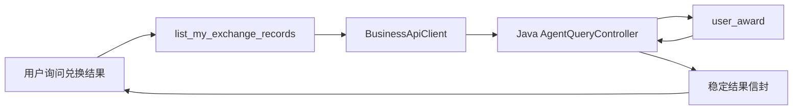

# 兑换最终结果查询闭环

> 兑换请求进入 RocketMQ 旧事务消息链路后，HTTP 受理结果只能说明“处理中”。本阶段补齐只读结果查询，使兑换助手能够依据数据库中的真实订单状态回答用户，而不是把受理成功误认为兑换成功。

## 1. 状态来源

最终状态来自 `user_award.status`：

| 数据库存值 | 对外状态 | 含义 |
| --- | --- | --- |
| `0` | `PROCESSING` | 消息已受理，异步消费尚未完成 |
| `1` | `SUCCESS` | 库存、积分和订单事务已完成 |
| 其他值 | `FAILED` | 异步业务处理失败 |

奖品名称通过 `user_award` 与 `award_config` 关联读取。结果查询不会修改订单，也不会触发消息重试。

## 2. 调用链

Java 接口支持查询全部记录，也支持使用 `awardId` 查询指定奖品。用户身份仍由 Python 服务端根据 JWT 绑定，模型不能填写其他用户 ID。

## 3. 边界

- `EXCHANGE_PROCESSING` 和 `PROCESSING` 都不等于兑换成功。
- 查询 Tool 只读真实状态，不轮询、不自动重发兑换请求。
- 出现未知提交状态时，用户可以查询记录；仍无记录时不能据此断言原请求一定没有被受理。
- 下一步在 Web 页面展示该查询结果，形成用户可见的订单入口。
