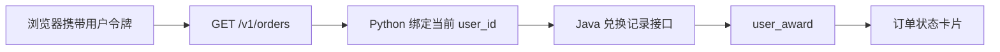

# 用户订单页面与状态轮询

> Agent 已能查询兑换结果，但真实用户不应为了查看订单而反复组织自然语言。本阶段增加独立订单页面，使对话负责理解和受理，页面负责稳定展示异步结果。

## 1. 页面数据流



浏览器不能提交 `user_id`，因此无法通过修改请求参数读取其他用户的订单。

## 2. 返回模型

订单接口返回的数据模型如下：

```json
{
  "orderId": 101,
  "awardId": 6,
  "awardName": "城市随行保温杯",
  "status": "PROCESSING",
  "statusMessage": "兑换正在处理中",
  "createTime": "2026-08-24T10:00:00",
  "updateTime": "2026-08-24T10:00:01"
}
```

`orderId` 是真实 `user_award.id`，不是前端临时编号。状态只允许为 `PROCESSING`、`SUCCESS` 和 `FAILED`，页面不根据等待时长猜测结果。

## 3. 轮询策略

- 页面首次打开时查询一次。
- 每次 Agent 对话完成后刷新一次，兑换确认后可以较快显示新记录。
- 仅当结果中仍有 `PROCESSING` 时，每两秒执行一次只读查询。
- 全部记录进入 `SUCCESS` 或 `FAILED` 后自动停止轮询。
- 手动刷新只查询状态，绝不重新提交兑换。

## 4. 职责边界

对话 Agent 可以回答“我的兑换怎么样了”，订单页面也可以直接展示同一事实。两者共享 Java 查询契约，但没有互相依赖：即使模型服务不可用，用户仍能查看最终订单状态。

## 5. 验证结果

- Python Client、订单 Tool、Prompt 路由和 Web API 定向测试：`15/15`。
- Java 用户查询服务定向测试：`6/6`。
- React/TypeScript 生产构建通过。
- 本轮遵循“定向优先、里程碑全量”，没有执行项目全量回归。
