# Agent 核心代码调用全景

> 这张图用于回顾当前项目中 Agent 请求从哪里进入、模型如何选择 Tool、Skill 如何访问业务数据，以及短期记忆、长期记忆、RAG、受控兑换和智能运营分别落在哪一层。图中只保留当前真实存在的代码，不包含已经回滚的 MCP，也不包含尚未实现的多 Agent 调度器。

## 1. 核心调用图

```mermaid
flowchart TB
    USERUI["用户页面 web-ui"] --> WEB["HTTP 入口 app/web.py"]
    OPUI["运营工作台 web-ui"] --> WEB
    SERVER["进程入口 app/server.py"] --> WEB

    subgraph USERFLOW["兑换助手 Agent"]
        UAUTH["用户鉴权 app/auth.py"]
        URUNTIME["运行时 app/runtime.py AgentRuntime"]
        UROUTE["普通对话路由"]
        DETERMINISTIC["确认或取消的确定性路由"]
        UAGENT["Agent 组装与执行 app/agent.py"]
        PROMPT["系统提示词 app/prompt.py"]
        CONTEXT["上下文窗口 app/context_window.py"]
        CHECKPOINT["短期会话记忆 InMemorySaver"]
        UTOOLS["用户 Tool 注册 app/tools.py"]

        UAUTH --> URUNTIME
        URUNTIME -->|普通对话| UROUTE
        URUNTIME -->|明确确认或取消| DETERMINISTIC
        UROUTE --> UAGENT
        PROMPT --> UAGENT
        CONTEXT --> UAGENT
        CHECKPOINT --> UAGENT
        UAGENT --> UTOOLS
    end

    WEB -->|用户对话接口| UAUTH

    PAGEQUERY["奖品中心与订单页面只读接口"]
    WEB --> PAGEQUERY

    subgraph USERSKILLS["用户 Tool 与 Skill"]
        QUERYTOOLS["积分 任务 奖品 资格 订单查询"]
        POINTSSKILL["积分规划 PointsPlanningSkill"]
        GOALSKILL["目标规划 SavedGoalPlanningSkill"]
        RECOMMENDSKILL["奖品推荐 AwardRecommendationSkill"]
        EXCHANGETOOL["准备兑换与取消兑换"]
        EXCHANGESKILL["受控兑换 ControlledExchangeSkill"]
        MEMORYTOOL["长期记忆读写 Tool"]
        MEMORYSKILL["记忆处理 GrowthMemorySkill"]
        RAGTOOL["业务知识检索 Tool"]

        UTOOLS --> QUERYTOOLS
        UTOOLS --> POINTSSKILL
        UTOOLS --> GOALSKILL
        UTOOLS --> RECOMMENDSKILL
        UTOOLS --> EXCHANGETOOL
        UTOOLS --> MEMORYTOOL
        UTOOLS --> RAGTOOL
        EXCHANGETOOL --> EXCHANGESKILL
        DETERMINISTIC --> EXCHANGESKILL
        MEMORYTOOL --> MEMORYSKILL
    end

    subgraph OPFLOW["智能运营 Agent"]
        OAUTH["运营鉴权 app/operator/auth.py"]
        ORUNTIME["运营运行时 OperatorAgentRuntime"]
        INTENT["意图分类 app/operator/intent.py"]
        OAGENT["运营 Agent app/operator/agent.py"]
        OTOOLS["运营 Tool app/operator/tools.py"]
        SNAPSHOT["活动规划快照"]
        CAMPAIGNSKILL["活动草案 CampaignPlanningSkill"]
        ORAG["运营知识检索"]

        OAUTH --> ORUNTIME
        ORUNTIME --> INTENT
        INTENT --> OAGENT
        OAGENT --> OTOOLS
        OTOOLS --> SNAPSHOT
        OTOOLS --> CAMPAIGNSKILL
        OTOOLS --> ORAG
    end

    WEB -->|运营对话接口| OAUTH

    subgraph WORKBENCH["运营工作台确定性流程"]
        WORKFLOW["草案提交 审核 发布 指标回流"]
        RULE["权限校验 状态机 版本校验"]
        WORKFLOW --> RULE
    end

    WEB -->|工作台接口| WORKFLOW

    subgraph SHARED["共享基础能力"]
        LLM["大模型 ChatOpenAI"]
        CLIENT["业务客户端 app/api_client.py"]
        EXECUTION["安全执行上下文 app/execution_context.py"]
        TRACE["调用轨迹 app/trace.py"]
        SKILLREGISTRY["Skill 清单 app/skills/registry.py"]
        MODELS["数据契约 app/models.py"]
        SETTINGS["配置 app/config.py"]
    end

    UAGENT --> LLM
    UAGENT --> EXECUTION
    EXECUTION -.-> EXCHANGETOOL
    OAGENT --> LLM
    UTOOLS -.-> TRACE
    OTOOLS -.-> TRACE
    POINTSSKILL --> SKILLREGISTRY
    CAMPAIGNSKILL --> SKILLREGISTRY
    SETTINGS -.-> URUNTIME
    SETTINGS -.-> ORUNTIME
    MODELS -.-> UTOOLS
    MODELS -.-> OTOOLS

    subgraph MEMORY["记忆与兑换授权"]
        LONGMEMORY["长期记忆 app/memory"]
        MEMORYBACKEND["内存 Redis 或 MySQL"]
        CONFIRMSTORE["确认凭证 app/exchange"]
        CONFIRMBACKEND["进程内存或 Redis"]

        MEMORYSKILL --> LONGMEMORY
        GOALSKILL --> LONGMEMORY
        LONGMEMORY --> MEMORYBACKEND
        EXCHANGESKILL --> CONFIRMSTORE
        CONFIRMSTORE --> CONFIRMBACKEND
    end

    subgraph KNOWLEDGE["RAG 知识链路"]
        DOCS["knowledge 业务文档"]
        CATALOG["知识治理 catalog.py"]
        INDEX["切分与索引 index.py"]
        VECTOR["本地 Chroma 向量索引"]
        SEARCH["检索与冲突处理 search.py"]

        DOCS --> CATALOG
        CATALOG --> INDEX
        INDEX --> VECTOR
        VECTOR --> SEARCH
        RAGTOOL --> SEARCH
        ORAG --> SEARCH
    end

    QUERYTOOLS --> CLIENT
    PAGEQUERY --> CLIENT
    POINTSSKILL --> CLIENT
    GOALSKILL --> CLIENT
    RECOMMENDSKILL --> CLIENT
    EXCHANGESKILL --> CLIENT
    MEMORYSKILL --> CLIENT
    SNAPSHOT --> CLIENT
    CAMPAIGNSKILL --> CLIENT
    RULE --> CLIENT

    subgraph JAVA["Java 业务系统"]
        QUERYAPI["AgentQueryController"]
        COMMANDAPI["AgentCommandController"]
        OPQUERYAPI["AgentOperatorQueryController"]
        CAMPAIGNAPI["CampaignWorkflowController"]
        OLDCHAIN["旧事务消息兑换链路"]
        DATABASE["MySQL Redis RocketMQ"]

        QUERYAPI --> DATABASE
        COMMANDAPI --> OLDCHAIN
        OLDCHAIN --> DATABASE
        OPQUERYAPI --> DATABASE
        CAMPAIGNAPI --> DATABASE
    end

    CLIENT --> QUERYAPI
    CLIENT --> COMMANDAPI
    CLIENT --> OPQUERYAPI
    CLIENT --> CAMPAIGNAPI
```

## 2. 一次用户对话如何执行

1. `web.py` 的 `/v1/chat` 从令牌中取得可信 `user_id`，生成或透传 `request_id`，然后调用 `AgentRuntime.answer`。
2. `AgentRuntime` 先按 `user_id + session_id` 获取会话锁。若输入是对待确认兑换的明确确认或取消，直接走确定性路由，不再让模型判断。
3. 普通对话通过 `_agent_for` 获取当前用户的 Agent。首次使用时，`build_agent` 将模型、Prompt、Tool、上下文中间件和 Checkpointer 组装为 LangChain Agent。
4. 模型根据 Tool Schema 选择 `tools.py` 中的工具。简单查询直接调用 `BusinessApiClient`；多步骤业务由对应 Skill 编排；知识问题进入 RAG；偏好和目标进入长期记忆。
5. Tool 和 Skill 返回结构化结果，模型只负责组织用户可理解的答案。使用 RAG 时，`agent.py` 还会检查并补齐当前轮次的知识引用。

## 3. 一次受控兑换如何执行

1. 模型只能调用 `prepare_exchange`，由 `ControlledExchangeSkill.prepare` 查询实时兑换资格并生成服务端确认记录，不立即兑换。
2. 确认记录由 `ConfirmationStoreBackend` 保存，可使用进程内存或 Redis；前端只能看到兑换摘要，看不到内部确认凭证。
3. 用户下一轮明确确认后，`AgentRuntime` 检测到待确认记录并绕过模型，调用 `ControlledExchangeSkill.confirm`。
4. Skill 原子认领确认记录，再通过 `BusinessApiClient` 调用 Java `AgentCommandController`，最终进入项目保留的旧事务消息兑换链路。
5. 确定性执行结果通过 `append_agent_turn` 写回短期会话记忆，使下一轮对话能够看到真实结果。

## 4. 一次运营对话如何执行

1. `/v1/operator/chat` 先使用 `operator/auth.py` 绑定运营身份与权限，再进入 `OperatorAgentRuntime`。
2. `OperatorIntentRouter` 将当前请求分为知识咨询、方案规划或执行请求，并据此收敛本轮可见 Tool，而不是把所有 Tool 都交给模型。
3. 运营 Agent 可读取活动规划快照、检索运营知识，或使用 `CampaignPlanningSkill` 生成并保存草案。
4. 草案提交、审核、发布和指标回流不由模型自行执行，而由运营工作台调用 `web.py` 中的确定性接口，再交给 Java `CampaignWorkflowController` 校验权限、状态与版本。

## 5. 推荐阅读顺序

| 顺序 | 文件 | 回顾重点 |
| --- | --- | --- |
| 1 | `app/web.py` | HTTP 入口、身份绑定、用户与运营两条入口 |
| 2 | `app/runtime.py` | 用户 Agent 生命周期、会话隔离、确认操作确定性路由 |
| 3 | `app/agent.py` | 模型、Prompt、Tool、中间件和 Checkpointer 如何组装 |
| 4 | `app/tools.py` | 模型实际能调用哪些用户能力，Tool 与 Skill 的边界 |
| 5 | `app/skills/` | 积分规划、奖品推荐、目标规划、长期记忆和受控兑换的确定性业务编排 |
| 6 | `app/api_client.py` | Python 如何调用 Java，如何统一处理信封、重试和请求 ID |
| 7 | `app/operator/agent.py` | 运营意图分类后如何构建不同 Tool 集合的 Agent |
| 8 | `app/operator/tools.py` | 规划快照、运营知识和活动草案的 Tool 契约 |
| 9 | `app/knowledge/` | 知识治理、切分建索引、检索、受众隔离和冲突处理 |
| 10 | `app/memory/` | 长期记忆的数据模型、召回和可切换存储实现 |
| 11 | `app/exchange/` | 一次性兑换确认记录及原子状态迁移 |
| 12 | Java Agent Controller 与旧兑换链路 | Agent 查询、写操作最终如何落到真实业务系统 |

## 6. 最容易混淆的三个边界

- **Tool 与 Skill**：Tool 是给模型看的调用入口；Skill 才负责多个确定性步骤的业务编排。
- **短期记忆与长期记忆**：`InMemorySaver` 保存会话消息；`app/memory/` 保存跨会话仍有价值的偏好、目标和稳定信息。
- **Agent 与确定性执行**：模型可以理解意图、选择只读能力和生成草案，但兑换确认、活动审核与发布必须由可信代码执行状态校验。
