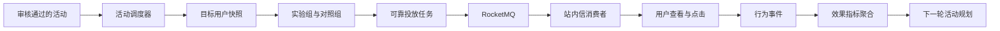

# 活动执行与效果观测技术方案

> 当前系统已经完成“Agent 生成草案 -> 人工审核 -> 确定性发布 -> 人工回写效果”，但发布只生成活动事实，并不等于活动已经触达用户。本阶段补齐活动调度、实验分组、站内触达、行为采集和自动指标回流，同时明确区分真实执行与演示模拟。

## 1. 目标与边界

第一阶段面向当前活跃用户完成真实站内活动闭环，第二阶段再为沉默用户提供明确标记的外部渠道模拟。Agent 仍只负责理解目标、生成草案和解释结果；客群计算、分组、调度、投放和指标计算全部由 Java 确定性服务执行。

当前不接入真实短信、Push 或邮件供应商，也不把演示行为解释成真实增长收益。站内信可以真实写入本地用户收件箱，但只适合活跃用户，不承担三十天未登录用户的首触达。

## 2. 核心链路



## 3. 数据职责

| 表 | 事实含义 | 关键约束 |
| --- | --- | --- |
| `user_activity_summary` | 用户最后登录和活跃时间 | 每个用户一行，Fixture 与真实来源可区分 |
| `campaign_execution` | 发布活动的一次执行实例 | 每个活动最多一个执行实例 |
| `campaign_target_user` | 执行开始时固定的客群和实验分组 | 每个活动与用户只有一个分组 |
| `campaign_delivery_task` | 可重试的渠道投放任务 | 每个活动、用户和渠道最多一个任务 |
| `user_notification` | 用户真正可读取的站内消息 | 每个投放任务最多生成一条消息 |
| `campaign_event` | 送达、查看、点击和转化事件 | `event_key` 防止同一事件重复计数 |

`campaign_activity` 继续表示已经发布的活动，`campaign_execution` 单独表示实际执行状态。二者分开后，审核发布状态不会与任务重试状态混在一起。

## 4. 状态与一致性

```text
活动执行：PENDING -> RUNNING -> COMPLETED / FAILED
投放任务：PENDING -> PROCESSING -> SENT / RETRY_WAIT / DEAD
站内消息：UNREAD -> READ -> CLICKED
```

系统不追求依赖消息中间件实现“只投递一次”，而是采用至少一次投递加数据库幂等：调度器可以重复扫描，MQ 可以重复发送，Consumer 也可以重复消费，但唯一键保证不会重复创建目标用户、投放任务或站内消息。

## 5. 实验与指标

客群筛选回答“哪些用户符合活动条件”，实验分组回答“活动是否带来了增量”。实验组生成投放任务，对照组不触达，但两组在同一观察窗口内的任务完成和兑换结果都会被统计。

第一阶段统计执行人数、成功率、失败与重试，以及查看率、点击率、任务完成率、兑换率和实验组相对对照组的增量。七日召回和后续留存必须等用户活跃事实可用后再启用；真实渠道送达、投诉和真实 ROI 不在当前验收范围内。

## 6. 开发顺序

1. 建立数据契约和活跃时间基线。
2. 实现活动调度、客群快照和实验分组。
3. 使用 RocketMQ 完成可靠投放和真实站内信。
4. 采集行为事件并自动聚合活动漏斗。
5. 让运营 Agent 只读查询执行与效果。
6. 增加与真实数据严格隔离的演示行为模拟器。

每一步先运行模块测试；完整模块完成后再执行 Java、Python 和前端全量回归，减少无价值的重复等待。
