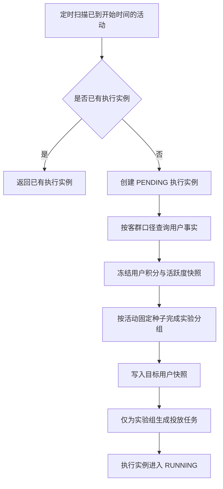

# 活动客群快照与实验分组

> 这一阶段解决的是：活动审核发布后，系统如何把一句“面向某类用户”转换为固定、可审计、可重复执行的用户名单，并保留一组不触达的对照用户，用于判断活动是否真的产生增量效果。

## 1. 为什么不能让 Agent 临时选择用户

Agent 适合把运营目标整理成草案，但不适合决定最终投放名单。投放名单必须满足：

1. 同一个客群标识每次按同一数据库口径计算。
2. 活动开始时冻结名单，后续用户积分变化不能改写历史样本。
3. 同一活动重复扫描时不能换组，也不能重复生成投放任务。
4. 对照组不得收到活动消息，否则无法计算实验组带来的增量。

因此，Agent 只在草案里选择服务端支持的 `target_segment_key`；Java 服务负责圈选、分组和落库。

## 2. 当前支持的客群

| 标识 | 计算口径 | 数据来源 |
| --- | --- | --- |
| `ALL_USERS` | `user_currency` 中的全部用户 | MySQL |
| `POINTS_AT_LEAST_500` | 当前积分不少于 500 | MySQL |
| `ACTIVE_LAST_7_DAYS` | `last_active_at` 不早于当前时间前 7 天 | MySQL 活跃摘要 |
| `INACTIVE_30_DAYS` | `last_login_at` 早于当前时间前 30 天 | MySQL 活跃摘要 |

自然语言客群不会由服务端猜测。例如“最近比较活跃的人”不会自动等价为近 7 天活跃，运营端需要选择明确口径。

## 3. 执行流程



`campaign_execution.activity_id`、`campaign_target_user(activity_id, user_id)` 和 `campaign_delivery_task(activity_id, user_id, channel)` 均有唯一约束。调度器即使每 5 秒扫描一次，也只能得到同一套事实。

## 4. 数据模型实例

### 4.1 客群查询投影

`CampaignAudienceUser` 不是独立表，而是积分表与活跃摘要联查后的只读投影：

```json
{
  "userId": 18,
  "points": 860,
  "lastActiveAt": "2026-07-12T15:30:00+08:00",
  "dataSource": "FIXTURE"
}
```

### 4.2 冻结后的目标用户

```json
{
  "executionId": 1,
  "activityId": 1,
  "userId": 18,
  "experimentGroup": "TREATMENT",
  "deliveryChannel": "DEMO_PUSH",
  "pointsSnapshot": 860,
  "dataSource": "FIXTURE"
}
```

这里保存的是活动开始时的事实。即使用户之后积分变为 1200，当前活动的 `pointsSnapshot` 仍保持 860，便于解释当时为什么圈中该用户。

## 5. 实验分组算法

默认实验组占比为 `9000` 万分比，即 90%。实现步骤为：

1. 用户按 `user_id` 排序，消除数据库返回顺序的不确定性。
2. 使用 `activity_id` 作为固定随机种子打乱名单。
3. 按配置比例取实验组，其余进入对照组。
4. 总人数大于 1 时，只要比例不是 0% 或 100%，至少保留 1 名实验用户和 1 名对照用户。
5. 分组结果立即写入 MySQL，后续以数据库快照为准，不重新计算。

这种做法追求的是可复现与可审计，不是让模型根据用户画像主观挑选实验组。

## 6. 渠道路由边界

| 条件 | 渠道 | 是否真实执行 |
| --- | --- | --- |
| 对照组 | `NONE` | 不生成投放任务 |
| 实验组且未超过 30 天未活跃 | `IN_APP` | 下一阶段生成真实站内信 |
| 实验组且超过 30 天未活跃 | `DEMO_PUSH` | 仅允许进入隔离的演示外部渠道 |

`DEMO_PUSH` 不能伪装成短信、App 推送或真实召回。后续由独立模拟器处理，并将产生的行为标记为 `SIMULATED`。

## 7. 本地真实验证

本地活动 `activity_id=1` 使用 `POINTS_AT_LEAST_500` 客群。调度器真实执行后得到：

| 数据 | 结果 |
| --- | ---: |
| 圈选用户 | 12 |
| 实验组 | 11 |
| 对照组 | 1 |
| `IN_APP` 待投放任务 | 8 |
| `DEMO_PUSH` 待投放任务 | 3 |
| 对照组投放任务 | 0 |

等待两个额外扫描周期后，`campaign_execution / campaign_target_user / campaign_delivery_task` 行数仍为 `1 / 12 / 11`，证明重复扫描没有生成重复执行、重复快照或重复投放任务。

当前 12 个用户的活跃摘要来源均为 `FIXTURE`。这次验证可以证明程序执行、分组和幂等正确，但不能作为真实用户召回率或渠道效果数据。

## 8. 下一步

下一阶段从 `campaign_delivery_task` 读取 `PENDING` 任务：

1. 通过独立 RocketMQ Topic 投递任务标识。
2. 消费端按任务状态和唯一键实现至少一次消费下的幂等。
3. `IN_APP` 任务创建真实站内信。
4. `DEMO_PUSH` 任务只写演示渠道回执，不冒充外部供应商。
