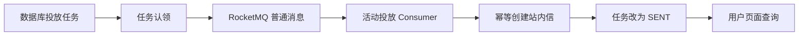

# RocketMQ 活动投放与站内信

> 这一阶段把上一阶段生成的“待投放任务”真正送到用户页面。活动调度器不直接写站内信，而是先留下数据库任务，再通过独立 RocketMQ Topic 异步投递；Consumer 负责幂等创建站内信并回写发送状态。

## 1. 为什么不让调度器直接写站内信

活动调度面对的是一批用户。如果在扫描活动时同步逐条写站内信，渠道短暂故障会拖住整批任务，也很难区分“尚未发送”和“发送失败”。现在把职责拆开：

1. `CampaignExecutionService` 固定客群与实验分组，生成 `campaign_delivery_task`。
2. `CampaignDeliveryDispatcher` 只认领到期的 `IN_APP` 任务并发送普通 RocketMQ 消息。
3. `CampaignDeliveryMessageListener` 消费消息，调用 `CampaignDeliveryService`。
4. `CampaignDeliveryService` 在同一数据库事务中创建站内信、把任务改为 `SENT`、累加执行发送数。

这条活动投放 Topic 与旧兑换事务消息链路完全独立。活动投放使用普通消息，旧兑换仍使用原来的事务消息，二者不共享 Producer Group、Consumer Group 或业务状态。



## 2. 消息与数据实例

MQ 消息只携带稳定事实的主键，不复制活动文案和用户状态：

```json
{
  "deliveryTaskId": 2
}
```

Consumer 收到后重新读取数据库任务和活动事实。这样即使消息重试，也始终围绕同一条任务执行，而不是相信一份可能过期的完整对象。

一条站内信在接口中的形态如下：

```json
{
  "id": 2,
  "activityId": 1,
  "title": "积分活动提醒",
  "content": "面向积分达标用户的活动目标说明",
  "status": "UNREAD",
  "readAt": null,
  "clickedAt": null,
  "createdAt": "2026-08-25T16:16:48"
}
```

页面只获得当前令牌所属用户的消息，不接收前端传入的任意用户 ID。消息状态按 `UNREAD -> READ -> CLICKED` 单向推进，点击“查看活动”后记录点击并跳到奖品区域。

## 3. 至少一次投递如何避免重复

RocketMQ 可能重复投递，调度器也可能在发送后、落库前重启，因此这里不假设消息只出现一次，而是使用数据库幂等：

| 风险 | 处理方式 |
| --- | --- |
| 调度器重复扫描 | 条件更新只允许可投递状态被一个线程认领 |
| `PROCESSING` 任务因进程退出卡住 | 超过 60 秒自动恢复后重试 |
| MQ 重复消费 | `user_notification.delivery_task_id` 唯一 |
| 重复累加发送人数 | 只有首次把任务更新为 `SENT` 才累加 |
| 不属于当前用户的消息被操作 | 查询和更新 SQL 同时校验 `notification_id + user_id` |

发送异常时任务进入等待重试状态，五秒后重新认领。消息体无法解析属于不可恢复的毒消息，记录错误后确认，避免无限阻塞 Consumer。

## 4. 真实验收结果

本地活动 1 在上一阶段生成 11 条实验组任务：8 条 `IN_APP`、3 条 `DEMO_PUSH`。新版本启动后的结果为：

| 指标 | 结果 |
| --- | ---: |
| `IN_APP` 任务 | `8 SENT` |
| 实际站内信 | `8` |
| 执行实例 `sent_users` | `8` |
| `DEMO_PUSH` 任务 | `3 PENDING` |

8 条站内信分别属于 8 个用户，初始状态均为 `UNREAD`。真实调用用户 10 的接口后，消息成功经历 `UNREAD -> READ -> CLICKED`；用户 11 操作同一消息返回 `NOTIFICATION_NOT_FOUND`，证明用户隔离生效。

`DEMO_PUSH` 没有真实外部渠道，因此继续保持 `PENDING`，不会被伪装成已经触达。当前数据证明的是执行链路正确，不代表活动产生了真实增长收益。

## 5. 下一步

下一阶段在这条事实链上增加 `DELIVERED`、`VIEW`、`CLICK` 等活动事件，再按实验组和对照组自动聚合漏斗。运营 Agent 只读取聚合后的真实指标，不自行推测触达率或活动收益。
