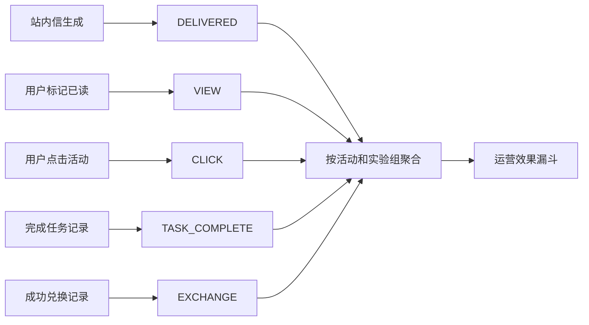

# 活动事件与自动实验漏斗

> 本阶段把“人工填写一个活动效果数字”改成“从业务事实自动生成事件，再按实验组和对照组计算漏斗”。运营工作台展示的是可追溯的用户数、分母和转化率；Fixture 数据始终标记为演示数据，不能被解释成真实增长收益。

## 1. 为什么不能继续手工录入

手工填写 `conversion_rate=0.3` 存在三个问题：不知道样本来自哪里、不知道分母是什么、也无法追溯到具体业务事实。本轮保留历史指标写入接口用于导入旧报表，但运营台主流程改为自动漏斗。

确定性链路如下：



## 2. 事件数据长什么样

一次站内信点击会被投影为类似记录：

```json
{
  "eventKey": "notification:click:2",
  "activityId": 1,
  "userId": 10,
  "eventType": "CLICK",
  "source": "SIMULATED",
  "occurredAt": "2026-08-25T16:20:00+08:00",
  "metadataJson": {"notification_id": 2}
}
```

| 字段 | 含义 |
| --- | --- |
| `eventKey` | 业务事实的稳定唯一键；定时任务重复扫描时不会重复插入 |
| `eventType` | `DELIVERED/VIEW/CLICK/TASK_COMPLETE/EXCHANGE` |
| `source` | `REAL` 或 `SIMULATED`，继承目标用户快照的数据来源 |
| `metadataJson` | 原始站内信、任务记录或兑换记录的 ID，便于追查 |

任务和兑换事件的键带有活动 ID，例如 `task:complete:1:42`。同一条任务记录可能落入不同活动的观察窗口，因此必须按活动隔离。

## 3. 如何从业务表生成事件

`CampaignEventProjector` 每两秒扫描尚未投影的事实：

1. `user_notification.created_at` 生成 `DELIVERED`。
2. `user_notification.read_at` 生成 `VIEW`。
3. `user_notification.clicked_at` 生成 `CLICK`。
4. 用户被分组后新增的 `finish_task_record` 生成 `TASK_COMPLETE`。
5. 用户被分组后状态为成功的 `user_award` 生成 `EXCHANGE`。

查询使用 `left join campaign_event ... where e.id is null` 减少重复读取，写入再使用 `insert ignore` 和唯一键兜底。因此即使进程在查询后、写入前重启，下一轮也可以安全重试。

## 4. 漏斗口径与公式

实验组会收到触达，对照组不会收到触达，但两组都会观察任务完成和兑换结果。

| 指标 | 计算方式 | 为什么这样选分母 |
| --- | --- | --- |
| 送达率 | `送达人数 / 实验组目标人数` | 看投放链路覆盖了多少目标用户 |
| 阅读率 | `阅读人数 / 送达人数` | 只有收到站内信的用户才可能阅读 |
| 点击率 | `点击人数 / 送达人数` | 当前口径衡量每次有效送达带来的点击 |
| 任务完成率 | `完成任务人数 / 该组目标人数` | 实验组和对照组可直接比较 |
| 兑换率 | `成功兑换人数 / 该组目标人数` | 实验组和对照组可直接比较 |
| 任务完成 Lift | `实验组任务完成率 - 对照组任务完成率` | 衡量活动带来的绝对增量 |
| 兑换 Lift | `实验组兑换率 - 对照组兑换率` | 衡量活动带来的绝对增量 |

这里的 Lift 是百分点差，不是相对提升比例。例如实验组 `30%`、对照组 `20%`，Lift 为 `10` 个百分点。

一次接口返回的数据模型如下：

```json
{
  "activityId": 1,
  "dataSource": "SIMULATED",
  "treatment": {
    "targetedUsers": 11,
    "deliveredUsers": 8,
    "viewedUsers": 1,
    "clickedUsers": 1,
    "deliveryRate": 0.727273,
    "viewRate": 0.125,
    "clickRate": 0.125
  },
  "control": {"targetedUsers": 1},
  "taskCompletionLift": 0,
  "exchangeLift": 0
}
```

## 5. 自动快照为什么不会无限增长

`campaign_effect_metric` 增加 `(activity_id, metric_name, source_ref)` 唯一键。自动快照使用 `source_ref=AUTO_EXECUTION:<executionId>`，定时刷新执行 `upsert`，所以同一个执行实例始终只有九个当前指标，而不是每五秒新增九行。

事件事实保留完整历史，指标表保存当前聚合快照。这相当于“明细事实 + 可快速读取的物化结果”。
运营端的 `GET /funnel` 只根据现有事实计算并返回结果，不借查询请求写数据库；只有后台聚合任务负责更新快照。

## 6. 本地真实运行结果

活动 1 当前数据：

| 项目 | 结果 |
| --- | ---: |
| 总目标用户 | 12 |
| 实验组 / 对照组 | 11 / 1 |
| `DELIVERED` | 8 |
| `VIEW` | 1 |
| `CLICK` | 1 |
| 实验组送达率 | 72.73% |
| 阅读率 / 点击率 | 12.5% / 12.5% |
| 自动指标快照 | 9 行 |

等待多个定时周期后，事件仍为 10 行、自动指标仍为 9 行；Java 直连接口和 Agent 运营代理接口返回相同结果。定向验证包括 Java `4/4`、Python `2/2` 与前端生产构建。

这些用户的活跃摘要来源是 Fixture，因此结果只能证明事件、聚合和展示链路正确。任务 Lift、兑换 Lift 当前均为 0，不能据此判断活动无效；下一步需要隔离的演示行为模拟器来验证非零实验差异，再等待真实用户行为数据验证实际收益。
