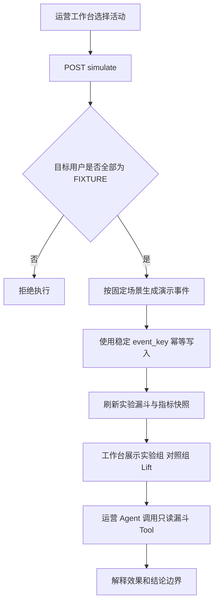

# 活动演示与效果分析闭环

> 本文说明如何在没有真实运营流量的本地环境中验证“发布活动 -> 产生行为 -> 计算 Lift -> Agent 解读效果”，同时确保演示数据不会污染真实任务、订单、积分和库存。

## 1. 为什么需要独立演示器

活动 1 的客群和活跃摘要来自 Fixture。此前虽然已经生成站内信、自动事件和漏斗，但任务完成与兑换 Lift 都为 0，无法完整演示效果分析。

直接伪造 `finish_task_record` 或 `user_award` 会制造不存在的任务、订单和兑换结果，因此本次只向活动分析专用的 `campaign_event` 写入明确标记为 `SIMULATED` 的事件。演示器用于证明系统闭环可以运行，不用于证明活动真实有效。

## 2. 执行流程



模型不参与演示数据生成。固定比例、资格校验、事件写入和指标计算都由 Java 确定性服务完成；模型只负责读取事实并用自然语言解释。

## 3. 固定场景

当前只支持 `DEMO_BASELINE_V1`，不允许调用方任意填写转化率。

| 分组 | 事件 | 固定比例 | 取整方式 |
| --- | --- | ---: | --- |
| 实验组 | 送达 | 100% | 全部 |
| 实验组 | 阅读 | 70% | 向上取整 |
| 实验组 | 点击 | 45% | 向上取整 |
| 实验组 | 完成任务 | 55% | 向上取整 |
| 实验组 | 成功兑换 | 25% | 向上取整 |
| 对照组 | 完成任务 | 20% | 向下取整 |
| 对照组 | 成功兑换 | 8% | 向下取整 |

用户先按 `user_id` 排序，同一组内点击用户是阅读用户的子集，兑换用户是任务完成人群的子集，使演示结果可重复。

一条演示事件的数据形态如下：

```json
{
  "eventKey": "simulation:DEMO_BASELINE_V1:1:10:TASK_COMPLETE",
  "activityId": 1,
  "userId": 10,
  "eventType": "TASK_COMPLETE",
  "source": "SIMULATED",
  "metadataJson": {
    "scenario": "DEMO_BASELINE_V1",
    "mode": "DETERMINISTIC_FIXTURE"
  }
}
```

`eventKey` 同时包含场景、活动、用户和事件类型。数据库 `insert ignore` 使重复点击不会新增同一事件，第二次执行只会重新读取当前漏斗。

## 4. 数据隔离边界

演示器必须同时满足以下条件：

1. 活动已经生成执行实例和目标用户快照。
2. 每个目标用户的 `data_source` 都明确等于 `FIXTURE`。
3. 场景必须等于服务端固定的 `DEMO_BASELINE_V1`。

任意目标用户是 `REAL`、混合来源或未知来源时，服务端在写事件前返回 `CAMPAIGN_SIMULATION_REQUIRES_FIXTURE`。

演示器不会修改：

- `finish_task_record`
- `user_award`
- `user_currency`
- 奖品库存和库存分片
- 真实用户站内信

它只写 `campaign_event`，并刷新 `campaign_effect_metric` 的当前自动快照。

## 5. HTTP 与 Agent 边界

### 5.1 确定性工作台写入口

```http
POST /v1/operator/campaign/activities/1/simulate
Authorization: Bearer <operator-token>
Content-Type: application/json

{"scenario_key":"DEMO_BASELINE_V1"}
```

该入口要求 `campaign:metric` 权限，只在工作台演示按钮中使用，不注册为模型可调用 Tool。

### 5.2 Agent 只读分析入口

运营 Agent 新增：

```text
get_campaign_funnel(activity_id=1)
```

该 Tool 只调用 `GET /funnel`，可用于知识咨询和方案分析，不具备生成演示数据、发布活动或修改指标的能力。System Prompt 要求 Agent：

- 必须根据漏斗事实回答，不能猜测数据。
- `SIMULATED` 只能解释为流程演示。
- 对照组或总体样本过小时，必须提示结论不稳定。

## 6. 本地验收数据

活动 1 有 11 名实验组用户、1 名对照组用户。首次执行结果：

| 指标 | 执行前 | 执行后 |
| --- | ---: | ---: |
| 新增演示事件 | 0 | 34 |
| 实验组完成任务人数 | 0 | 7 |
| 实验组成功兑换人数 | 0 | 3 |
| 对照组完成任务人数 | 0 | 0 |
| 对照组成功兑换人数 | 0 | 0 |
| 任务完成 Lift | 0 | 63.64% |
| 兑换 Lift | 0 | 27.27% |

第二次执行返回 `CAMPAIGN_SIMULATION_ALREADY_APPLIED`，新增事件为 0。等待后台聚合周期后，活动事件保持 44 行，其中固定演示事件 34 行；自动指标保持 9 行。

运营 Agent 的真实轨迹为：

```text
PLAN_REQUEST
  -> get_campaign_funnel(activity_id=1)
  -> CAMPAIGN_FUNNEL_FOUND
```

Tool 耗时约 9ms。回答正确指出数据为演示来源，列出实验组与对照组差异，并说明 11/1 的样本不能形成稳定的真实运营结论。

## 7. 验证范围

- Java 全量测试通过；演示器定向覆盖固定事件数量、真实用户拒绝和重复执行。
- 运营相关 Python 测试 `25/25` 通过。
- 前端 TypeScript 检查和生产构建通过。
- APP、Agent、MySQL、Redis、RocketMQ 和 Canal 本地启动状态正常。

至此，本地环境已经能完整体验运营活动从规划、审核、发布、投放、行为事件、实验漏斗到 Agent 效果解读的闭环。真实收益仍需由真实用户行为、合理样本量和持续观察窗口验证。
