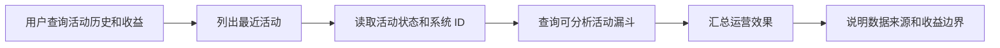

# 活动历史自动发现与效果解释

> 本文记录运营人员只说“查看活动历史以及收益”时，Agent 如何自行发现活动、读取效果数据并解释收益边界，而不是把内部活动 ID 作为用户必须提供的参数。

## 1. 原始问题

旧版只有：

```text
get_campaign_funnel(activity_id)
```

模型知道查漏斗必须有 ID，却没有可调用的活动发现能力，因此回复“请提供活动 ID”。这不是用户表达不完整，而是 Agent 的 Tool 集不完整：前端可以列活动，Agent 却看不到同一事实。

## 2. 修复后的调用链



普通历史查询不需要用户理解系统主键。只有用户明确指向某个活动，但活动名称、目标和时间仍无法区分时，Agent 才继续追问。

## 3. 活动发现 Tool

新增只读 Tool：

```text
list_campaign_activities(limit=5)
```

后端原始活动对象包含完整 `planJson`，但历史发现只需要少数字段。Tool 会裁剪为：

```json
{
  "id": 1,
  "objective": "提高高积分用户任务参与率",
  "targetSegmentKey": "POINTS_AT_LEAST_500",
  "budgetAmountCents": 100000,
  "pointsIssuanceCap": 5000,
  "startAt": "2026-08-24T18:27:15Z",
  "endAt": "2026-08-30T18:27:15Z",
  "status": "ACTIVE",
  "publishedAt": "2026-08-23T18:27:21Z"
}
```

这样既能让模型自动取得 `id`，也不会把与当前问题无关的完整草案占满上下文。

## 4. 决策规则

对于“活动历史、最近活动、活动效果、活动收益”等只读请求：

1. 立即调用 `list_campaign_activities`，不返回功能菜单，不先索要 ID。
2. 对已经开始或结束的活动调用 `get_campaign_funnel`。
3. 对尚未开始、还没有执行实例的活动，只说明当前状态，不伪造效果。
4. “收益”默认解释为任务完成率、兑换率和 Lift 等运营效果。
5. 没有财务收入、实际成本和 ROI 事实时，不输出金额收益。
6. `SIMULATED` 和小样本结果必须明确标注，不能冒充真实活动收益。

## 5. 真实复验

测试问题：

```text
查看活动历史以及收益
```

修复前轨迹：

```text
intent = KNOWLEDGE_QUERY
events = []
结果 = 索要活动 ID 或返回功能菜单
```

修复后轨迹：

```text
list_campaign_activities(limit=5)
  -> get_campaign_funnel(activity_id=2)
  -> get_campaign_funnel(activity_id=1)
```

活动 2 尚未开始，返回 `CAMPAIGN_EXECUTION_NOT_FOUND`；Agent 将其解释为“已排期、暂无效果”。活动 1 返回 `CAMPAIGN_FUNNEL_FOUND`；Agent 汇总了任务完成率、兑换率和 Lift，并明确说明：

- 数据来源为 `SIMULATED`。
- 实验组与对照组为 `11/1`，结论不稳定。
- 当前没有财务收入、实际成本和 ROI，不能给出金额收益。

本次请求不再要求运营人员提供活动 ID。

## 6. 验证范围

- 运营 Agent 与活动工作流定向测试 `10/10` 通过。
- Tool 测试证明活动可自动发现，且完整 `planJson` 不进入 Agent 上下文。
- 真实模型请求完成三次 Tool 调用并生成有事实依据的回答。
- 本次只运行相关定向测试，没有执行无关模块的全量回归。
